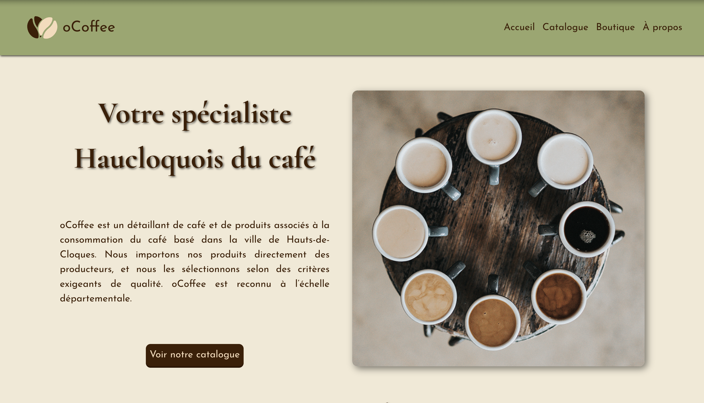

# ☕ **O'Coffee**  

> Un site vitrine pour une boutique de café, réalisé dans le cadre de ma formation.  

## **Aperçu**  
 

## **Technologies utilisées**  
Ce projet a été développé avec les technologies suivantes :  

- **Backend** : [Express.js](https://expressjs.com/), [EJS](https://ejs.co/), [PG (node-postgres)](https://node-postgres.com/)  
- **Base de données** : [PostgreSQL](https://www.postgresql.org/)  
- **Frontend** : HTML, CSS, JavaScript  

## **Fonctionnalités**  
- Présentation des différents cafés disponibles  
- Navigation dynamique avec EJS  
- Connexion à une base de données PostgreSQL pour stocker les produits  

## **Crédits**  
Les illustrations utilisées pour les pages d'erreur sont fournies par **Vecteezy** - [Lien vers la source](https://fr.vecteezy.com/vecteur-libre/grains-de-caf%C3%A9)  

## **Licence**  
Ce projet est sous licence **MIT** – voir le fichier [LICENSE](./LICENSE) pour plus de détails.  

---

